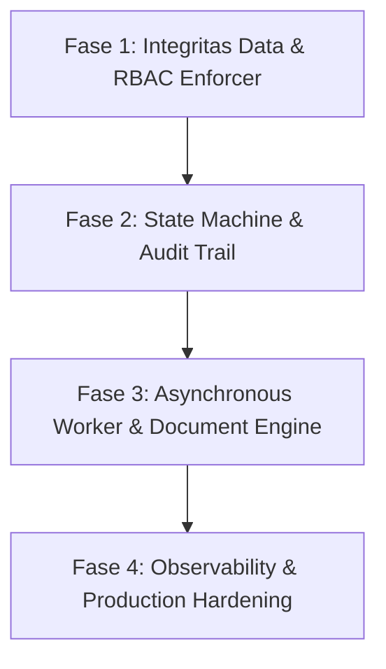

# 🚀 Panduan Kesiapan Backend ERP Level Production (Production Readiness Guide)

Dokumen ini memuat standar, analisis kesenjangan (*gap analysis*), dan peta jalan (*roadmap*) teknis untuk membawa backend **Nexus ERP (Modern ERP System)** dari tahap *development/prototype* menuju standar sistem **Enterprise Production-Ready**.

---

## 📑 Daftar Isi
1. [Ringkasan Arsitektur & Status Saat Ini](#1-ringkasan-arsitektur--status-saat-ini)
2. [7 Pilar Backend ERP Production & Gap Analysis](#2-7-pilar-backend-erp-production--gap-analysis)
   - [Pilar 1: Integritas Data & Concurrency Control](#pilar-1-integritas-data--concurrency-control)
   - [Pilar 2: Audit Trail & Compliance (Jejak Audit)](#pilar-2-audit-trail--compliance-jejak-audit)
   - [Pilar 3: Workflow Engine & Approval Matrix (State Machine)](#pilar-3-workflow-engine--approval-matrix-state-machine)
   - [Pilar 4: Background Processing (Celery & Redis)](#pilar-4-background-processing-celery--redis)
   - [Pilar 5: Document & Report Engine (Generator PDF / Excel)](#pilar-5-document--report-engine-generator-pdf--excel)
   - [Pilar 6: Keamanan & Granular RBAC Enforcer](#pilar-6-keamanan--granular-rbac-enforcer)
   - [Pilar 7: Observability, Logging & Error Tracking](#pilar-7-observability-logging--error-tracking)
3. [Peta Jalan Implementasi (Actionable Roadmap)](#3-peta-jalan-implementasi-actionable-roadmap)

---

## 1. Ringkasan Arsitektur & Status Saat Ini

* **Pola Arsitektur**: *Modular Monolith* berbasis Django 6.0 & Django REST Framework (DRF).
* **Database**: PostgreSQL dengan relasi antar modul (`hr_module`, `finance_module`, `inventory_module`, `purchasing_module`, `sales_module`, `rbac`).
* **Autentikasi**: JSON Web Token via `djangorestframework-simplejwt`.
* **Kondisi Saat Ini**: Fondasi domain bisnis sudah sangat baik dan terstruktur rapi. Namun, mekanisme pengamanan integritas data tingkat tinggi, audit trail, serta pembatasan akses granular di layer ViewSet masih memerlukan penguatan untuk siap digunakan di lingkungan produksi yang memiliki konkurensi tinggi.

---

## 2. 7 Pilar Backend ERP Production & Gap Analysis

---

### Pilar 1: Integritas Data & Concurrency Control

#### A. Mengapa Dibutuhkan di ERP?
Kesalahan data finansial dan inventaris tidak boleh terjadi. Jika dua kasir/admin memproses stok barang terakhir (stok = 1) di saat yang persis bersamaan, tanpa penguncian baris database (*row-level locking*), stok bisa menjadi minus (-1) atau terjadi *lost update*. Selain itu, jika transaksi melibatkan banyak tabel dan salah satu gagal, seluruh operasi wajib dibatalkan (*rollback*).

#### B. Kondisi Saat Ini di Kode
* **Inventory**: Pada file `backend/inventory_module/models.py` di fungsi receiver `handle_stock_movement`, penambahan/pengurangan stok dan pemotongan layer FIFO belum dibungkus oleh `transaction.atomic()` dan `.select_for_update()`. Belum ada validasi yang menolak transaksi jika stok gudang tidak mencukupi (stok bisa bernilai negatif).
* **HR Module**: Pada `backend/hr_module/views.py` di action `approve_hr`, pengurangan saldo cuti (`LeaveBalance`) dan perubahan status cuti belum dibungkus dalam blok atomik.

#### C. Solusi Teknis & Contoh Implementasi
1. Bungkus mutasi stok dengan transaksi atomik dan *pessimistic lock*.
2. Tolak pergerakan barang tipe `OUT` jika kuantitas melebihi stok yang tersedia.

```python
# Contoh implementasi pada Inventory Service / Receiver:
from django.db import transaction
from django.core.exceptions import ValidationError

@transaction.atomic
def process_stock_out(product_id, warehouse_id, quantity):
    # Lock row untuk mencegah race condition
    balance = StockBalance.objects.select_for_update().get(
        product_id=product_id, 
        warehouse_id=warehouse_id
    )
    
    if balance.quantity < quantity:
        raise ValidationError(f"Stok tidak mencukupi! Tersedia: {balance.quantity}, Diminta: {quantity}")
        
    balance.quantity -= quantity
    balance.save()
```

---

### Pilar 2: Audit Trail & Compliance (Jejak Audit)

#### A. Mengapa Dibutuhkan di ERP?
Sistem ERP wajib memiliki akuntabilitas mutlak untuk audit finansial dan kepatuhan hukum:
- Siapa yang mengubah gaji pokok karyawan?
- Siapa yang mengubah harga satuan barang atau menghapus transaksi?
- Berapa nilai sebelum dan sesudah perubahan?

#### B. Kondisi Saat Ini di Kode
* Belum ada pencatatan histori perubahan data otomatis pada model-model sensitif seperti `EmployeeProfile`, `SalaryComponent`, `JournalEntry`, dan `Product`.

#### C. Solusi Teknis & Rekomendasi
* Menggunakan paket standar **`django-simple-history`** atau membuat model tabel `AuditLog` generic.
* `django-simple-history` secara otomatis membuat tabel bayangan `Historical<ModelName>` setiap kali terjadi operasi `INSERT`, `UPDATE`, atau `DELETE`, mencatat *user*, *timestamp*, dan perbedaan nilai (*delta changes*).

```python
# Contoh penambahan pada models.py:
from simple_history.models import HistoricalRecords

class SalaryComponent(models.Model):
    # ... fields
    history = HistoricalRecords()
```

---

### Pilar 3: Workflow Engine & Approval Matrix (State Machine)

#### A. Mengapa Dibutuhkan di ERP?
Dokumen bisnis (Pengajuan Cuti, Purchase Order, Pengeluaran Kas) memiliki siklus hidup bertingkat (*approval chain*). 
1. Transisi status harus valid (tidak boleh loncat dari `Draft` langsung ke `Approved`).
2. Begitu dokumen berstatus `Approved` atau `Posted`, dokumen tersebut **wajib dikunci (*immutable/read-only*)** dan tidak boleh diedit kembali.
3. Hak persetujuan harus memvalidasi relasi organisasi (hanya atasan langsung pemohon yang berhak melakukan `approve_spv`).

#### B. Kondisi Saat Ini di Kode
* Pada `backend/hr_module/views.py` (`LeaveRequestViewSet`), aksi `approve_spv`, `approve_manager`, dan `approve_hr` sudah memiliki validasi status string dasar, namun:
  - Belum memvalidasi apakah `request.user` benar-benar supervisor dari pemohon.
  - Belum ada pencegahan di metode `update()` / `partial_update()` jika dokumen yang sudah `APPROVED` diedit kembali oleh user melalui API.

#### C. Solusi Teknis
* Tambahkan pengecekan ketat pada serializer/model `clean()`:

```python
def update(self, request, *args, **kwargs):
    instance = self.get_object()
    if instance.status in ['APPROVED', 'REJECTED']:
        return Response(
            {"error": "Dokumen yang sudah disetujui/ditolak tidak dapat diubah lagi."},
            status=status.HTTP_400_BAD_REQUEST
        )
    return super().update(request, *args, **kwargs)
```

---

### Pilar 4: Background Processing (Celery & Redis)

#### A. Mengapa Dibutuhkan di ERP?
Operasi seperti penggajian ribuan karyawan (*payroll processing*), penutupan buku akhir bulan (*monthly ledger closing*), rekonsiliasi stok, dan sinkronisasi mesin absensi memakan waktu lama dan tidak boleh memblokir *request thread* HTTP.

#### B. Kondisi Saat Ini di Kode
* Konfigurasi Celery sudah disiapkan di `backend/core/settings.py` baris 165, namun menggunakan SQLite broker (`sqla+sqlite:///celerydb.sqlite`).
* SQLite broker tidak mendukung konkurensi worker produksi dan rawan *database lock*.
* Paket `celery` dan driver broker belum terdaftar di `requirements.txt`.

#### C. Solusi Teknis
1. Ganti broker Celery ke **Redis** yang memiliki performa in-memory tinggi.
2. Tambahkan **Celery Beat** untuk jadwal otomatisasi rutin (misal *auto-checkout* absensi karyawan pada pukul 23:59 atau rekap sisa cuti tahunan).

```python
# settings.py produksi
CELERY_BROKER_URL = os.environ.get('REDIS_URL', 'redis://127.0.0.1:6379/0')
CELERY_RESULT_BACKEND = os.environ.get('REDIS_URL', 'redis://127.0.0.1:6379/0')
```

---

### Pilar 5: Document & Report Engine (Generator PDF / Excel)

#### A. Mengapa Dibutuhkan di ERP?
Operasional bisnis memerlukan dokumen cetak resmi yang sah secara hukum:
* **Slip Gaji Karyawan** (bersifat konfidensial)
* **Purchase Order (PO)** untuk vendor dengan kop surat dan tanda tangan digital
* **Surat Jalan / Delivery Order (DO)**
* **Faktur Penjualan / Invoice**

#### B. Kondisi Saat Ini di Kode
* Backend saat ini murni menyajikan data dalam bentuk JSON. Pengguna belum dapat mengunduh dokumen resmi dalam format PDF standar dari server.

#### C. Solusi Teknis
* Integrasikan generator PDF di backend seperti **`ReportLab`** (ringan dan cepat) atau **`WeasyPrint`** (berbasis template HTML & CSS Django).
* Sediakan endpoint khusus, contoh: `GET /api/hr/payroll/<id>/slip-pdf/`.

---

### Pilar 6: Keamanan & Granular RBAC Enforcer

#### A. Mengapa Dibutuhkan di ERP?
Data ERP menyimpan rahasia perusahaan (gaji, margin profit, nomor rekening). Autentikasi dan otorisasi harus berlapis:
1. **Simple JWT**: Token harus memiliki masa aktif singkat untuk mencegah penyalahgunaan saat token bocor, dilengkapi mekanisme *token blacklisting* saat logout/force logout.
2. **Granular RBAC**: Hak akses tidak cukup hanya `IsAuthenticated`. Setiap aksi spesifik harus memverifikasi *permission slug* pemanggilnya.

#### B. Kondisi Saat Ini di Kode
* Daftar permission sudah dibuat lengkap di `backend/rbac/management/commands/seed_permissions.py` (contoh: `hr.leave.approve`, `inventory.movement.create`).
* Namun, mayoritas ViewSet di modul inventory dan HR hanya menggunakan `permission_classes = [IsAuthenticated]`, sehingga pengguna biasa yang login masih bisa menembak endpoint approval jika mengetahui URL-nya.
* `ACCESS_TOKEN_LIFETIME` pada Simple JWT masih tersetting 1 hari tanpa modul blacklist.

#### C. Solusi Teknis
1. Buat custom DRF Permission Class `HasPermission`:

```python
# rbac/permissions.py
from rest_framework.permissions import BasePermission

class HasPermission(BasePermission):
    def __init__(self, required_permission):
        self.required_permission = required_permission

    def __call__(self):
        return self

    def has_permission(self, request, view):
        if not request.user or not request.user.is_authenticated:
            return False
        if request.user.is_superuser:
            return True
        return request.user.user_permissions.filter(permission__slug=self.required_permission).exists()
```

2. Terapkan *Token Blacklist* dan persingkat masa aktif access token:

```python
SIMPLE_JWT = {
    'ACCESS_TOKEN_LIFETIME': timedelta(minutes=15),
    'REFRESH_TOKEN_LIFETIME': timedelta(days=7),
    'ROTATE_REFRESH_TOKENS': True,
    'BLACKLIST_AFTER_ROTATION': True,
}
```

---

### Pilar 7: Observability, Logging & Error Tracking

#### A. Mengapa Dibutuhkan di ERP?
Ketika transaksi gagal di production, tim teknis harus dapat merekonstruksi kejadian secara presisi tanpa harus meminta user mengulang kesalahan.

#### B. Kondisi Saat Ini di Kode
* Belum ada blok konfigurasi `LOGGING` di `backend/core/settings.py`. Pesan error hanya mengalir ke `stdout` konsol sementara dan rentan hilang saat server restart.

#### C. Solusi Teknis
* Pasang rotasi file logging Django untuk error kritis, audit transaksi, dan integrasikan Sentry SDK untuk pemantauan exception secara real-time.

```python
# settings.py
LOGGING = {
    'version': 1,
    'disable_existing_loggers': False,
    'handlers': {
        'file_error': {
            'level': 'ERROR',
            'class': 'logging.handlers.RotatingFileHandler',
            'filename': os.path.join(BASE_DIR, 'logs', 'error.log'),
            'maxBytes': 1024 * 1024 * 5,  # 5 MB
            'backupCount': 5,
        },
    },
    'loggers': {
        'django': {
            'handlers': ['file_error'],
            'level': 'ERROR',
            'propagate': True,
        },
    },
}
```

---

## 3. Peta Jalan Implementasi (Actionable Roadmap)

Penerapan standar produksi ini direkomendasikan untuk dijalankan dalam 4 fase terstruktur:



### 🔹 Fase 1: Keamanan & Integritas Data Kritis (Prioritas Tertinggi)
* [ ] Pasang `@transaction.atomic` dan `.select_for_update()` pada pemotongan cuti dan pergerakan stok barang.
* [ ] Tambahkan validasi anti-stok negatif pada mutasi barang tipe `OUT`.
* [ ] Buat class `HasPermission` di modul RBAC dan pasang pada aksi sensitif (approve cuti, create payroll, posting jurnal).
* [ ] Konfigurasi Simple JWT: perkecil lifetime access token (15 menit) dan aktifkan `token_blacklist`.

### 🔹 Fase 2: Siklus Dokumen & Audit Trail
* [ ] Pasang validasi status dokumen (kunci dokumen saat sudah `APPROVED` atau `POSTED`).
* [ ] Validasi hierarki atasan langsung pada approval cuti / reimbursement.
* [ ] Tambahkan `django-simple-history` pada model master karyawan, komponen gaji, dan jurnal akuntansi.

### 🔹 Fase 3: Asynchronous Worker & Dokumen Resmi
* [ ] Pasang Redis dan ganti broker Celery dari SQLite ke Redis.
* [ ] Tambahkan Celery Beat untuk tugas rutin terjadwal.
* [ ] Implementasikan endpoint generator PDF untuk Slip Gaji Karyawan dan Purchase Order (PO).

### 🔹 Fase 4: Observability & Deployment Hardening
* [ ] Buat konfigurasi `LOGGING` Django dengan rotasi file log di folder `logs/`.
* [ ] Siapkan reverse proxy (Nginx), Gunicorn, dan PgBouncer untuk PostgreSQL connection pooling.
* [ ] Integrasi Sentry untuk pelacakan bug real-time.
